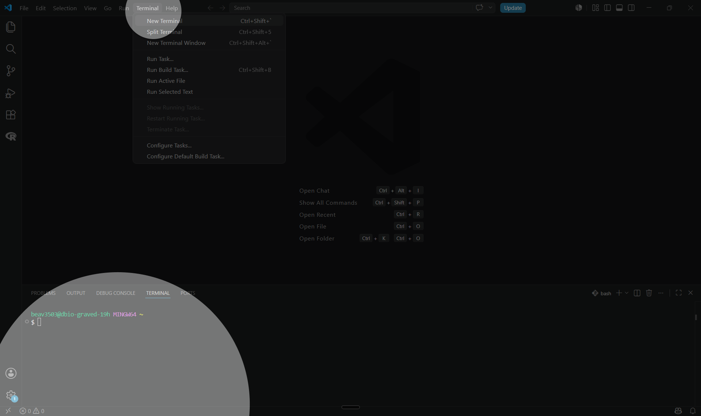
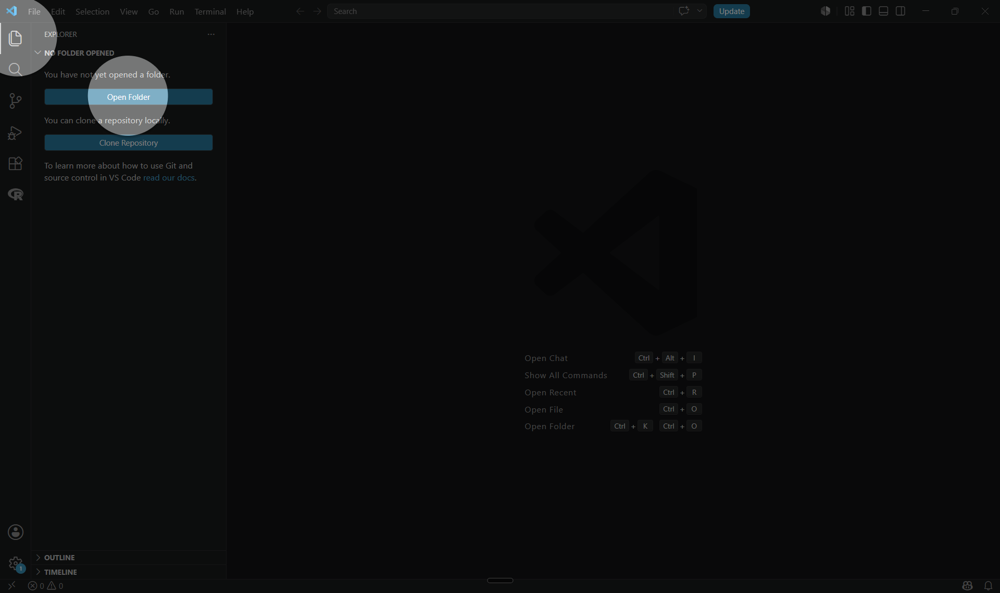
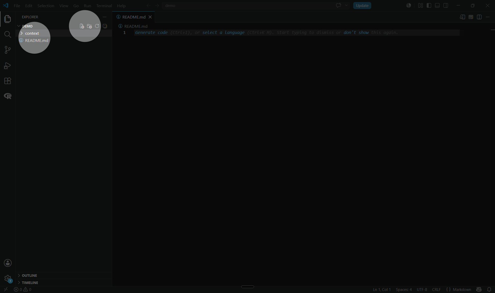
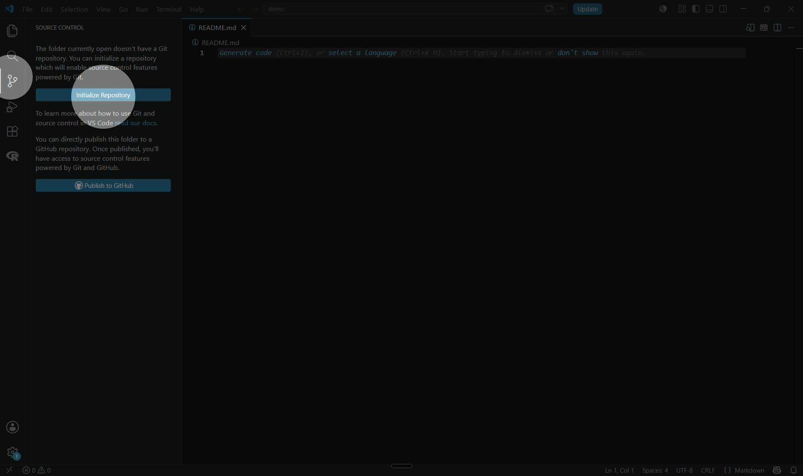
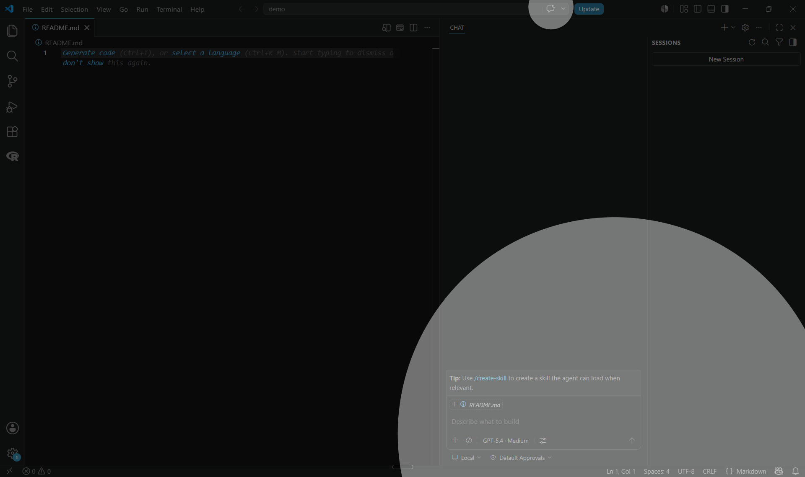
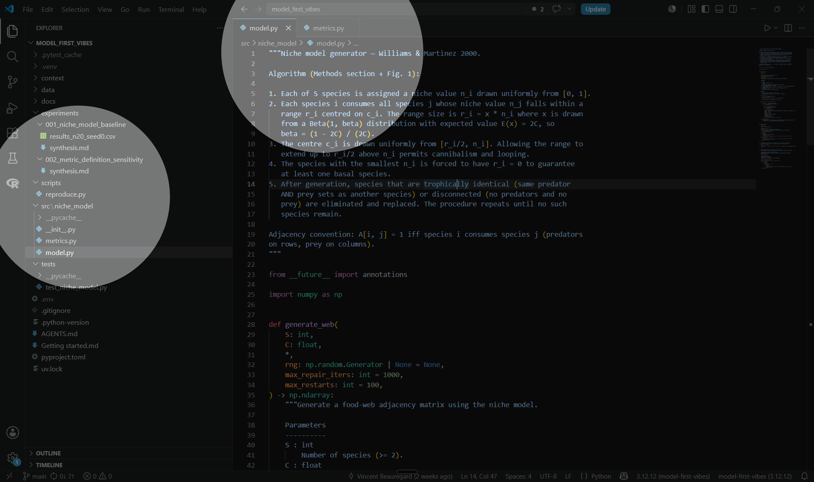
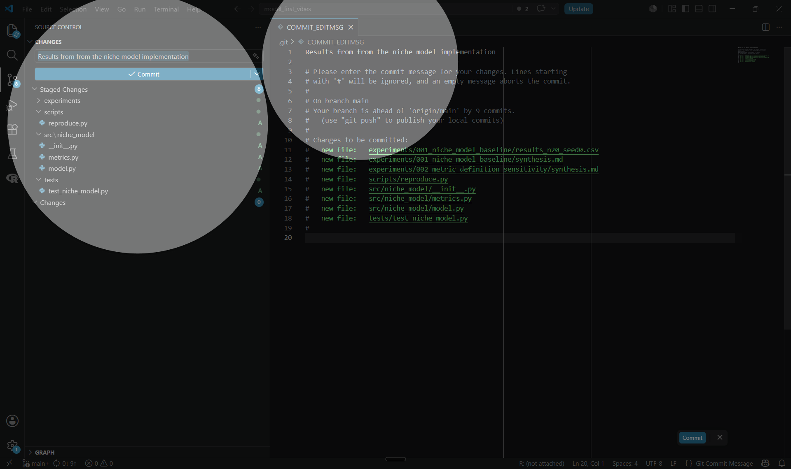

# Getting started

This guide should help you set up your Visual Studio Code (VS Code) environment for a new project and use an AI agent to assist you in an ecology modelling task. By completing it, you should be able to reproduce results from a scientific paper. Expect a couple of hours for a first pass on a small paper, longer for an end-to-end reproduction.

This guide was done with the objective of reproducing the results of the Williams & Martinez 2000 paper, "Simple rules yield complex food webs". Feel free to use and adapt the proposed steps and prompts as a template for your own model, goals and paper.

## 0. Set up your environment

We assume that you have correctly set up VS Code, Git, Python (R as an option), and the chat extension for GitHub Copilot or one of the equivalent agents from OpenAI or Anthropic. If not, follow [docs/environment_setup_en.md](environment_setup_en.md) first.

Make sure you have a GitHub account linked in VS Code.

It is very useful for the agent to have access to Python, so make sure it is installed on your machine. A project-level virtual environment (`venv`) is a good default, but a user-level Python install is fine too. Once your project is open, tell VS Code which interpreter to use via the command palette (*Ctrl + Shift + P*, then *Python: Select Interpreter*). The [VS Code Python environments documentation](https://code.visualstudio.com/docs/python/environments) covers the details if you need them.

## 1. Create a new project

### 1.0 Open a terminal

Terminal is recommended for the setup steps in this section, but you can do the same from the VS Code interface if you prefer. To open a terminal in VS Code, press **Ctrl + `** (backtick) on any platform, or go to *Terminal ▸ New Terminal*.



If you have multiple terminal profiles, make sure to select the one you are most comfortable with (e.g. Git Bash, PowerShell, or Command Prompt on Windows; Terminal on Mac). The terminal will open at the root of your project folder once you create it in the next step. You can edit the terminal profile settings in VS Code if you want to change the default shell or its appearance.

### 1.1 Create a new folder

This folder should contain all the files the agent might need to understand your code and what good artifacts to produce. Keep it well organised from the start.

We use Git Bash in the examples below for consistency across the workshop. The same commands work in any Unix-style shell (zsh, WSL); in PowerShell or Command Prompt, replace `~` with `$HOME` or `%USERPROFILE%`. From a prompt opened in your home directory:

```bash
cd ~
mkdir demo_paper_ai
cd demo_paper_ai
```

See the *Project structure* subsection of *Fundamentals* for the
folders that will appear as the project grows.

Then open the folder in VS Code (*File ▸ Open Folder…*).



### 1.2 Create a README.md

This is your reference for human collaborators in the project to understand:

- the purpose of the project;
- how to run the code;
- how the code is organised;
- decisions that were made;
- how to contribute.

Just write the project name and a brief description of what you want to
do.

**Example** — content for `README.md`:

```markdown
# Williams & Martinez reproduction of results

In this project we reproduce the results from the Williams & Martinez 2000 paper, "Simple rules yield complex food webs". The paper introduces a stochastic generator of food-web topology — the niche model — and evaluates it against seven empirical food webs on twelve structural metrics. Our aim is to generate those metrics from the same model and compare them to the published values.
```



### 1.3 Git init

Initialise version control from the same Git Bash prompt, and create an empty first commit so you always have a point to roll back to:

```bash
git init
git commit --allow-empty -m "Initial commit"
```

Or do the same from the VS Code *Source Control* panel.

Once the agent starts generating files in the next steps, ask it to create a `.gitignore` so that virtual environments, caches, and editor metadata stay out of your commits. Most agents will do this on their own if reminded.



### 1.4 Open the chat interface

Open the chat panel: press **Ctrl + Alt + I** on Windows/Linux, **Ctrl + Cmd + I** on Mac, or click the chat icon in the activity bar. At the top of the chat panel, switch the mode dropdown from **Ask** to **Agent**.



The difference between **Ask** and **Agent** matters. *Ask* answers your questions inside the conversation only, the way ChatGPT or Claude.ai do in a browser. *Agent* uses your project as its workspace — it can act on the codebase across several files in one turn. The tools commonly available to the agent in VS Code include:

- **read** files in the project;
- **edit** existing files;
- **create** new files and folders;
- **search** the codebase (grep, file globs);
- **run** terminal commands, tests, and scripts;
- **fetch** web pages, when allowed.

The trade-off is that you give up some direct control. Review the agent's diffs and command output as carefully as you would a collaborator's pull request. See the [GitHub Copilot agent mode documentation](https://code.visualstudio.com/docs/copilot/chat/chat-agent-mode) for the full feature surface.

Experiment with the agent at every stage — even setup. It can help you configure tooling and clarify your own goals.

> **Useful prompts**
>
> *Ask me a set of questions to clarify the goals of this project and
> the instructions you should follow.*

## 2. Describe your goals and build documentation

### 2.1 Include relevant context

Create a `context/` folder and drop the source material the agent will need into it:

```bash
mkdir context
```

A typical starting set:

- the scientific paper(s) you want to reproduce, as PDF;
- any framing text describing intent and constraints — for example a paragraph stating what success looks like, what is out of scope, and any data you already have;
- pointers to dependencies you already plan to use.

The agent will discover these files on its own once you start chatting.

> **Useful prompts**
>
> *Convert the PDFs in context/ to Markdown. Inspect the resulting
> Markdown to make sure its content and headers are correctly formatted
> and semantically cohesive.*

### 2.2 Create AGENTS.md/CLAUDE.md

Create `AGENTS.md`at the root of the project (or `CLAUDE.md` if you are using Claude Code) . This file contains instructions for the AI models that will work on the project; most modern agents (including GitHub Copilot) look for it at the project root and load it automatically into every new chat session. Its purpose is to customise the agent's behaviour and the actions it takes.

Relevant content includes the goals to be achieved in this project.

**Example** — content for `AGENTS.md`:

```markdown
The goal is to implement the niche model in R.

We want to modify the vegetation dynamics in the model to add density-dependence and to distinguish between herbaceous plants and trees.
```

Then describe the project structure, the coding environment (Python or R) and how to access the dependencies. Add general practices for how you want the agent to interact with you.

**Example** — content for `AGENTS.md`:

```markdown
Use R for modeling and analytics tasks.

I am unfamiliar with the network analysis presented in this paper. Include explanations of fundamental network analysis concepts and the rationale for any decisions.
```

You can also describe the workflow you expect the agent to follow.

**Example** — content for `AGENTS.md`:

```markdown
When launching a simulation, always test first with a light run (limited scope or low iteration count) to validate the model quickly.
```

> **Useful prompts**
>
> *Re-read AGENTS.md and tell me what is still ambiguous or what you
> would need to know to start coding.*
>
> *Suggest additions to AGENTS.md based on the conventions you have
> seen me apply during this session.*

### 2.3 Launch the agent on a task

Once the goals and context are in place, send a first task. Start small: ask the agent to propose a project structure and implement only the simplest version of the model. Review what it produces before asking for more.



***The content and structure of the resulting files can vary largely from what is displayed in the screen capture – AI is not deterministic !***

> **Useful prompts**
>
> *Propose a project structure and implement the simplest working
> version of the model described in context/. Stop and let me review
> before adding any feature beyond the bare minimum.*

## 3. Inspect and document

An important part of using an agent is understanding what it did: inspect the actions it took, the results it produced, and the edits it made. Ask it to explain its work, the decisions it made, and to create outputs and documentation that help you understand the results.

The agent translates your decisions into code, runs, and artifacts. It does not replace your scientific judgment: you define what counts as a successful reproduction, which assumptions are acceptable, and whether the output is ecologically plausible. 

> **Useful prompts**
>
> *Create a short Markdown document synthesising the work done this
> session and the decisions that were made — especially the ones that
> go beyond what the paper specifies.*
>
> *Package the last run into an archival folder: the script that was
> launched, the parameter file, the output, and a short README
> describing what produced this run and when.*
>
> *Draw an ASCII diagram of how data flows through the model from
> input to output, with one box per module and arrows showing what
> each module produces.*
>
> *Create a bar chart comparing our reproduced values to
> the ones reported in the paper, one row per metric.*

If you do not like how the agent organised some files or documentation, give clear instructions and examples on how to reorganise the results. Ask follow-up questions to make sure you understand the results and the decisions behind them.

Ask the agent to generate Markdown documentation about what it did so you can refer to it in future sessions, and to propose sensible next steps.

> **Useful prompts**
>
> *Summarise what you actually changed in the last turn in 10 lines or
> fewer.*
>
> *List the choices you had to make where the paper was ambiguous, and
> the convention you adopted for each.*

## 4. Commit and iterate

A reproducible project grows in small, reviewed loops: ask for one focused change, review what the agent did, commit the result, then move on to the next iteration. Once the baseline runs and you have reviewed it, the agent is well suited to the substantial tasks the working group expects it to support — implementing a fuller version of the model from the paper, running simulations with the data and parameters you provide, modifying the implementation to test an extension, and archiving the outputs of a run together with the inputs and command that produced them.

End each iteration with a commit. Whether you do it from the terminal or from the VS Code *Source Control* panel, the discipline is the same: stage the changes you have reviewed, give the commit a short description of what changed in this loop, and only then send the next prompt. See *Commit often* in *Fundamentals* for why this matters and how often to do it.

```bash
git add -A
git commit -m "Short description of what changed in this iteration"
```



> **Useful prompts**
>
> *Implement the equations from section X of the paper in context/.
> Add unit tests that check the behaviour on the simple cases described
> in the paper before claiming the implementation is correct.*
>
> *Run a single small simulation with the parameter set in [file].
> Save the output, the parameters, and the exact command used into a
> clearly named subfolder so the run can be reproduced later.*
>
> *We want to modify [aspect of the model] to [proposed change]. First
> list the parts of the codebase that will need to change and the
> assumptions that will be affected. Then make the changes.*

## Fundamentals, tips and tricks

### VS Code and IDEs

Integrated Development Environments (IDEs) are common in scientific coding. Most of you have used RStudio to edit scripts. VS Code provides similar tools — source control with Git, running code, exploring variables and results, and browsing the project folder. Other useful functionality includes debugging, running test suites, and code linting.

VS Code is a standard tool in the software development world, and it is well supported by AI agents. It is also more flexible than RStudio for working with Python and for customising your workflow. We recommend it for this project, but you can use any IDE that you want to use.

### Verify what the agent claims

When the agent says "the tests pass" or "the output matches the paper", treat it as a claim, not a fact. Re-run the same command yourself in a terminal, open the output file, and check the numbers against the source. AI-generated code can look correct while embedding numerical or conceptual errors — small mistakes in indexing, units, or metric definitions are common and rarely self-reported. The minimum reflex is to ask the agent for the exact command and the exact output, then re-run the command yourself and compare. For scientific content, also check ecological plausibility on your own — that is your job, not the agent's.

> **Useful prompts**
>
> *Show me the exact command you just ran and paste its full output,
> unedited.*
>
> *List every test that exists in the project, then run only the ones
> covering [feature] and show me the result.*

### Planning

Launching agent tasks can hide a very high token cost with variable results, especially when the task is not well defined. We recommend using the planning functionality of the agent to produce a Markdown document describing each step needed to achieve the goal. You can review this document iteratively and make decisions about code structure, scientific methodology, or expected outputs by interacting with the agent so it edits the plan accordingly. The plan can then be handed to a new agent session simply by asking it to implement the plan described in that Markdown file.

> **Useful prompts**
>
> *Before changing any code, draft a plan in plan.md: the question we
> want to answer, the steps you would take, the files you expect to
> touch, and the commands you would run. Stop after writing the plan
> and let me review it.*
>
> *Read plan.md and execute step 2 only. Stop after it is done.*

### Choosing the right model

Many models are available through GitHub Copilot, OpenAI, and Anthropic. Most have their own strengths, weaknesses, tone, and style. Modern models are better at tool calling and agentic workflows while being cheaper, but older or smaller models can still perform well when tasks are very explicit.

In our experience, the flagship reasoning model of each provider — Anthropic's Opus and OpenAI's GPT-5 with high reasoning effort at the time of writing — is strong for interactive project design and thinking a problem through. We find the OpenAI tone more technical and jargon-prone but the reasoning equally capable. We recommend either for planning and thinking a problem through.

Once the technical decisions are made, switch to a cheaper, faster model to execute the plan — at the time of writing, that means Anthropic's Sonnet, OpenAI's GPT-5 mini, or Google's Gemini Flash. These are good enough for routine code edits at a fraction of the cost per turn.

### Context management and documentation

The output of any AI chat session depends on two things:

1. the clarity of the input instructions and prompts;
2. the context available for the AI to understand the problem and guide its decisions.

The distinction between a regular chat session like ChatGPT and an agent is that with a regular chat you give it files as context that it will reuse to answer your input. An agent uses the files you point to, but it will also search and read files itself to build its own context until it considers it has enough knowledge to achieve its goal.

To help it, organise decisions, goals and relevant information — scientific papers, previous results, prior analyses — into well-structured Markdown files.

### Launch new chat sessions often

A long chat accumulates noise: stale errors, abandoned approaches, decisions that contradict each other. Start a fresh session whenever you find yourself scrolling up to remember what was decided, or when the agent keeps suggesting a fix that has already failed. AGENTS.md rebuilds the agent's context automatically, so starting over is cheap.

### Commit often

The agent can edit many files in a single turn, and sometimes deletes the wrong one. Commit every 15–30 minutes, even with a vague message, so you always have a safe point to roll back to. You can squash the history later if you want a tidier log.

### Project structure

A small, well-organised project helps the agent reason about your code and helps you find things later. The shape that worked for us:

| Folder / file | What goes there |
|---|---|
| `AGENTS.md` | Instructions the agent loads at every session — goals, stack, conventions, preferences. |
| `README.md` | What humans need to understand the project — purpose, how to run, decisions made. |
| `context/` | Raw source material the agent reads as input — paper PDFs, framing texts, external references you want it to consider. |
| `docs/` | Documentation you write and curate for humans — setup notes, design decisions, meeting notes. |
| `src/` (Python) or `R/` (R) | The actual implementation code, organised in modules. |
| `tests/` | Test suite. Keep it close to `src/` so the agent finds it when asked to add or run tests. |
| `data/` | External data the model consumes — empirical inputs, parameter files. Keep these out of `src/` so the code stays generic and the data can be swapped. |
| `scripts/` | Entry points you run from the command line — reproductions, batch jobs, one-off analyses. |

You do not need every folder on day one. Start with `AGENTS.md`, `README.md`, and `context/`, then let the agent suggest the rest as the project grows.
